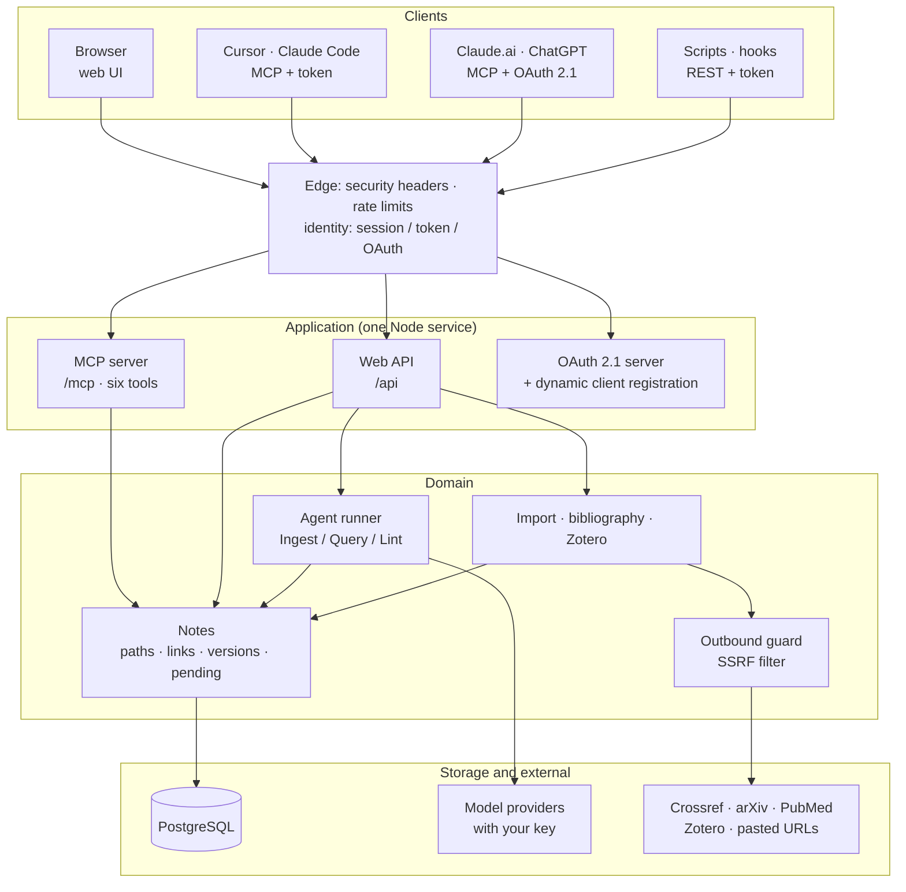
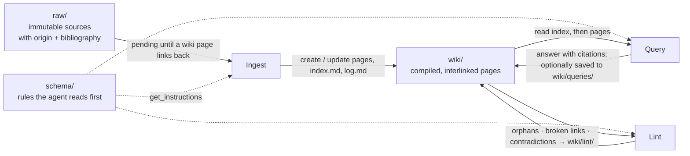

# WikiBrain

**Personal knowledge base.** Hosted at [wikibrain.app](https://wikibrain.app) (launching). A hosted implementation of Andrej Karpathy's **LLM Wiki** pattern: you curate sources, an AI agent compiles them into a persistent, interlinked Markdown wiki, and every AI client you already use (Cursor, Claude, ChatGPT, Claude Code…) reads and writes the same wiki through MCP.

> Open-source core (AGPL-3.0). A hosted version with billing, backups and mobile apps is run by the maintainer; self-hosting is fully supported with `docker compose`.

## What it does

- **Three layers.** `raw/` holds immutable sources, `wiki/` holds AI-compiled pages, `schema/` holds the compilation rules the agent reads before writing. `index.md` and `log.md` follow Karpathy's conventions.
- **Ingest, Query, Lint.** Sources that no wiki page links to are listed as *pending*; the agent ingests them (in Cursor via MCP, or on the web with your own API key), answers questions with citations in a chat panel, and health-checks the wiki (orphans, broken links, contradictions) into `wiki/lint/`.
- **Bring sources from anywhere.** URLs (readability + metadata, DOI → Crossref, arXiv, PubMed, headless fallback for SPAs), PDF, Word, HTML, Markdown, pasted text, images. BibTeX / CSL-JSON import and export. Zotero sync.
- **For researchers.** Bibliographic front-matter (`doi`, `authors`, `year`, `venue`, `citation_key`), pandoc-style `[@citekey]` citations rendered as (Author, Year) with an automatic reference list, a literature table view, BibTeX export that works with pandoc.
- **MCP server built in.** Six tools (`get_instructions`, `search_notes`, `read_note`, `create_note`, `update_note`, `list_folder`) over Streamable HTTP with optimistic locking. Bearer tokens for Cursor; OAuth 2.1 with dynamic client registration for Claude.ai, ChatGPT and other connectors.
- **Web UI.** Three-pane editor with live preview, backlinks, version history and rollback, force-directed graph with a timeline, front-matter table view (Dataview-style), Mermaid diagrams, Marp slide pages, KaTeX. Traditional Chinese and English interface; write your wiki in any language.
- **No lock-in.** One-click export of the whole wiki as an Obsidian-compatible Markdown zip, plus `.bib` / CSL-JSON.

## Architecture

One Node service and one PostgreSQL database. Every AI client talks to the same wiki through MCP; the web UI and the server-side agents use the same six tools.



How knowledge moves between the three layers (Karpathy's Ingest / Query / Lint, all done with the same six tools, by your AI client over MCP or by the server-side agent with your key):



## Self-host

```bash
git clone <this repo> && cd wikibrain
export BETTER_AUTH_SECRET=$(openssl rand -hex 32)
mkdir -p secrets && openssl rand -hex 32 > secrets/wikibrain_key   # encrypts users' API keys; kept out of env vars
export APP_URL=http://localhost:3000        # your public https URL in production (e.g. https://wikibrain.app)
docker compose up -d
open http://localhost:3000
```

Verification emails are printed to the container log unless `RESEND_API_KEY` is set. Google sign-in is enabled when `GOOGLE_CLIENT_ID`/`GOOGLE_CLIENT_SECRET` are set. The image includes headless Chromium so JavaScript-rendered pages can be imported (about 1.8 GB); set `IMPORT_HEADLESS=0` to disable it.

See [DEPLOY.md](DEPLOY.md) for Replit and other hosts, and `.env.example` for every variable.

## Connect an AI client

- **Cursor / Claude Code:** Settings → *Connect Cursor* generates a token and the `mcp.json` snippet (`{ "url": "https://<host>/mcp", "headers": { "Authorization": "Bearer …" } }`).
- **Claude.ai / ChatGPT / any OAuth-capable client:** add a custom connector with the URL `https://<host>/mcp`, sign in, press *Allow*. Connections are listed in Settings and can be revoked.
- **Web auto-ingest and chat:** store your own Anthropic, OpenAI or OpenRouter key in Settings; the server runs the agent with it. Token and cost statistics are shown per job.

## Develop

```bash
cp .env.example .env         # DATABASE_URL, BETTER_AUTH_SECRET, DEV_MCP_TOKEN
createdb wikibrain           # local PostgreSQL 16
npm install && npm run db:seed
npm run dev                  # API on :3000, web on :5173
npm test                     # backend end-to-end tests (real Postgres)
python3 test/e2e/m3_web.py   # Playwright E2E against the dev servers
```

Stack: Node 24, TypeScript (strict), Express 5, PostgreSQL (plain SQL migrations), `@modelcontextprotocol/sdk`, better-auth, React 19, Vite, Tailwind 4. `docs/` holds technical notes such as the URL import test matrix and the original UI prototype.

## License

AGPL-3.0. You may self-host and modify freely; if you offer a modified version as a network service you must publish your changes. The hosted service's billing, mailing and backup integrations are not part of this repository.
